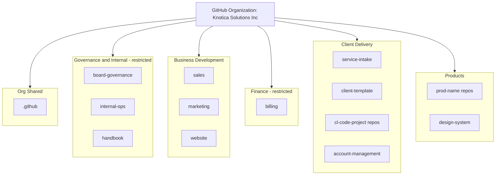
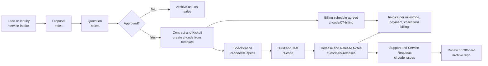

# GitHub Organization Design: Knotica Solutions Inc

| Field | Value |
|---|---|
| **Organization** | Knotica Solutions Inc (GitHub org slug: `knotica-solutions`) |
| **Document ID** | GOV-001 |
| **Status** | Draft for review |
| **Owner** | `<Founder / CTO>` |
| **Applies to** | All staff, contractors, and client collaborators |

> Company: **Knotica Solutions Inc**. The GitHub organization slug is assumed to be `knotica-solutions`; change it in `setup/config.env` if your actual slug differs.
>
> **Testing first:** the scaffold can run in a personal GitHub account (`MODE=personal`) before you create the organization. Teams, org Projects and branch protection need an organization, so they are skipped in that mode. See the scaffold `README.md`.

---

## 1. Design Goals

1. **One home for process:** workflows, proposals, specs, releases, and internal records are all versioned, searchable, and auditable.
2. **Client isolation:** a client must never see another client's data or our internal pricing and notes.
3. **Scales by cloning, not redesign:** onboarding client #50 takes the same 10 minutes as client #2.
4. **Usable by non-developers:** sales, admin, and board members work through issue forms and simple pull requests, not the command line.
5. **Everything approved leaves a trail:** merges, reviews, and labels serve as approval records.

## 2. The Key Decision: Multiple Repos, Not One Monorepo

GitHub permissions apply **per repository** (not per folder), and issues are visible to everyone with read access to the repo. A single monorepo cannot keep clients, HR, and the board separated. So we use **one organization with many focused repos**.

| Approach | Pros | Cons | Decision |
|---|---|---|---|
| Single monorepo | Simple search, one place | No folder-level access; client data exposed to all; poor audit | Rejected |
| **One org, repos by domain, one repo per client** | Clean access control; clients added as outside collaborators; easy archive | More repos to manage (mitigated by templates + naming) | **Chosen** |
| Separate org per client | Maximum isolation | Heavy admin overhead; hard to share standards | Only for very large or regulated clients |

## 3. Organization Architecture



### 3.1 Client Engagement Lifecycle and Where Each Stage Lives



## 4. Repository Catalog

| Repo | Visibility | Purpose | Who Has Access |
|---|---|---|---|
| `.github` | **Public** (required for org-wide defaults to apply; contains no confidential content) | Org-wide PR templates, reusable workflows, community health files, org profile | Owners write; all read |
| `handbook` | Private | Company processes, SOPs, workflow maps, policies, onboarding, **template library** (spec, proposal, quotation, report templates) | All staff read; Management write |
| `internal-ops` | Private | Leave requests, turnover (handover) reports, internal incident reports and post-mortems, internal announcements, meeting minutes, all-hands presentations | All staff |
| `board-governance` | Private, **restricted** | Board resolutions, approval requests, board minutes, board decks, financial approvals | Board + Owners only |
| `sales` | Private | Prospect tracking, proposals, quotations, pricing models, win/loss notes | Sales + Management |
| `marketing` | Private | Campaigns, content calendar, brand guidelines and assets, case-study drafts (client approval required before publishing) | Marketing + Management |
| `website` | Private source (public site) | Company website, blog, public release notes | Marketing + Delivery write |
| `service-intake` | Private | Front door for consulting inquiries and requests from prospects or non-repo clients; triaged then routed | Sales + Delivery leads |
| `client-template` | Private (**Template repo**) | Standard client repo structure copied for every new client | Management |
| `cl-<code>-<project>` | Private, one per client | **Client-shared workspace**: engagement, specs, design, delivery, testing, release notes, support, client-facing billing documents | Delivery team + client as outside collaborators |
| `billing` | Private, **restricted** | Invoices, payment acknowledgements, credit notes, statements, collections log, billing register. Client-facing copies go to each client's `07-billing/` folder | Finance + Management; delivery leads at Triage to request invoices |
| `account-management` | Private | **Staff-only** client notes: account plans, margins, internal retros, risks, renewal strategy (folder per client code) | Management + account owners |
| `prod-<name>` | Private or Public | Own products: code, design docs, roadmap, release notes, changelog | Product team |
| `design-system` | Private or Public | Reusable UI components, brand tokens, product design standards | Design + Product |

> **Why `account-management` is separate from `cl-<code>`:** anything in a client repo is visible to the client. Internal margins, candid retros, and risk notes must live elsewhere.
>
> **Why `billing` is separate too:** the invoice register, payments, collection notes and write-offs are internal. Only the invoices and statements we issue are copied into the client's `07-billing/` folder.

### 4.1 Naming Conventions

| Item | Pattern | Example |
|---|---|---|
| Client code | 3 to 5 letters, unique, never reused | `NWB` (Northwind Bank) |
| Client repo | `cl-<code>-<project>` | `cl-nwb-core-migration` |
| Product repo | `prod-<name>` | `prod-insightboard` |
| Branches | `feature/…`, `fix/…`, `doc/…`, `release/…` | `doc/spec-nwb-001` |
| Document IDs | `<TYPE>-<CODE or YEAR>-<###>` | `SPEC-NWB-001`, `PROP-2026-014`, `QUO-2026-031` |
| Incident IDs | `INC-<YYYY>-<###>` | `INC-2026-007` |
| Invoice | `INV-YYYY-###` | `INV-2026-001` |
| Payment acknowledgement | `RCT-YYYY-###` | `RCT-2026-001` |
| Credit note | `CN-YYYY-###` | `CN-2026-001` |
| Statement | `STMT-<CODE>-YYYY-MM` | `STMT-NWB-2026-10` |
| Files | lowercase, hyphens, ID first | `spec-nwb-001-user-login.md` |

## 5. Repo Structures

### 5.1 `cl-<code>-<project>` (copied from `client-template`)

```
cl-<code>-<project>/
├── README.md                    # Engagement summary, contacts, how to raise a request
├── CODEOWNERS                   # Review ownership
├── .github/
│   ├── ISSUE_TEMPLATE/          # service-request, change-request, bug-report, incident, question
│   ├── PULL_REQUEST_TEMPLATE.md
│   └── workflows/               # Calls reusable workflows from org .github repo
├── 00-engagement/               # Charter, signed SOW copy, RACI, comms plan, contacts
├── 01-specs/                    # SPEC-<code>-###-*.md  (uses Specification Design template)
├── 02-design/                   # Architecture, ADRs (decision records), diagrams, UX
├── 03-delivery/                 # Plan, weekly status reports, meeting notes, RAID log
├── 04-testing/                  # Test plans, UAT scripts, results
├── 05-releases/                 # CHANGELOG.md, release notes, deployment runbooks
├── 06-support/                  # Runbooks, SLA, client-facing incident reports
├── 07-billing/                  # Client-facing: billing schedule, issued invoices, statements, payment acknowledgements
└── assets/                      # Diagrams and images (large binaries via Git LFS)
```

### 5.2 `sales`

```
sales/
├── pipeline/                    # One folder per prospect: <year>-<prospect>/
│   └── 2026-northwind/          # lead-notes.md, proposal-v1.md, quotation-v1.md
├── templates/                   # Proposal, quotation, SOW, NDA templates
├── pricing/                     # Rate cards, estimation models (restricted by CODEOWNERS)
├── registers/                   # proposals.md, quotations.md (ID registers)
└── win-loss/                    # Post-decision reviews
```

### 5.3 `internal-ops`

```
internal-ops/
├── leave/                       # Leave policy summary + leave calendar (requests via issue form)
├── handover/                    # Turnover reports: YYYY-MM-<person>-<role>.md
├── incidents/                   # Internal incident reports and post-mortems: INC-YYYY-###.md
├── announcements/               # Internal communications, newsletters
├── meetings/                    # Minutes: weekly, monthly, all-hands
├── presentations/               # All-hands decks (PDF export or links; large files via LFS)
└── .github/ISSUE_TEMPLATE/      # leave-request, handover-report, incident-report, announcement
```

### 5.4 `board-governance`

```
board-governance/
├── resolutions/                 # BRD-YYYY-###-title.md (approved = merged)
├── approvals/                   # Approval requests raised as PRs
├── minutes/                     # Board meeting minutes
├── decks/                       # Board presentations (PDF)
├── financial/                   # Budgets and approvals summaries (no raw payroll or bank data)
└── CODEOWNERS                   # Every path requires Board review
```

### 5.5 `handbook`

```
handbook/
├── processes/                   # Workflow maps (Mermaid) and SOPs: sales, delivery, support, release
├── policies/                    # Security, data handling, code of conduct, leave, travel
├── onboarding/                  # New staff and new client onboarding checklists
├── templates/                   # Master copies: spec, proposal, quotation, SOW, report, release notes
├── standards/                   # Naming, labels, branching, documentation style
└── training/                    # Guides for using GitHub (for non-developers)
```

### 5.6 `billing`

```
billing/
├── invoices/<year>/             # INV-YYYY-###-<code>-<slug>.md (+ PDF)
├── payments/<year>/             # RCT-YYYY-###-<code>-<slug>.md (references only, no account numbers)
├── credit-notes/<year>/         # CN-YYYY-###-<code>-<slug>.md
├── statements/                  # STMT-<CODE>-YYYY-MM.md
├── collections/                 # One file per client: reminders, promises to pay, dispute outcomes
├── registers/                   # Knotica_Billing_Register.xlsx (invoices, payments, credit notes, client billing profiles, ageing)
├── reports/                     # Month-end receivables ageing and reconciliation sign-off
├── CODEOWNERS                   # Finance reviews everything; Management reviews credit notes and reports
└── .github/ISSUE_TEMPLATE/      # invoice-request, payment-received, credit-note-request, billing-dispute
```

### 5.7 `marketing`, `prod-<name>`, `service-intake`

```
marketing/      brand/  campaigns/  content-calendar/  case-studies/  social/  analytics/
prod-<name>/    src/  docs/design/  docs/specs/  roadmap/  CHANGELOG.md  release-notes/
service-intake/ .github/ISSUE_TEMPLATE/ (consulting-inquiry, service-request)  triage-guide.md
```

## 6. Document Types, Where They Live, and Who Approves

| Document | Repo / Path | Format | Approval Mechanism |
|---|---|---|---|
| Process / workflow | `handbook/processes` | Markdown + Mermaid | PR review by Management |
| Product design | `prod-*/docs/design`, `design-system` | Markdown, diagrams | PR review by Product lead |
| Proposal | `sales/pipeline/<prospect>` | Markdown → PDF | PR review by Sales lead; Management for large deals |
| Quotation | `sales/pipeline/<prospect>` | Markdown → PDF | PR review by Management (pricing owner) |
| Marketing content | `marketing` | Markdown | PR review by Marketing lead; client sign-off for case studies |
| Release notes | `cl-*/05-releases`, `prod-*/release-notes` | Markdown | Auto-drafted; reviewed by Delivery lead |
| Specification | `cl-*/01-specs`, `prod-*/docs/specs` | Markdown (Spec template) | PR review by Tech lead + QA + client (if shared) |
| Service consulting request | `cl-*` issues or `service-intake` issues | Issue form | Triage by Delivery lead |
| Leave application | `internal-ops` issues | Issue form | Approved by line manager (label `approved`) |
| Turnover report | `internal-ops/handover` | Markdown via issue/PR | Reviewed by manager and successor |
| Internal incident report | `internal-ops/incidents` | Markdown | Reviewed by Management |
| Board approval | `board-governance` | PR | Required reviewers from Board |
| Presentations | `internal-ops/presentations`, `board-governance/decks` | PDF or link | Owner of presentation |
| Internal communications | `internal-ops/announcements` | Markdown | Management |
| Billing schedule | `cl-*/07-billing` | Markdown | Agreed with the client at quotation or SOW stage; Management approves |
| Invoice | `billing/invoices` (copy in `cl-*/07-billing`) | Markdown → PDF | Finance prepares; approver per billing policy |
| Payment acknowledgement | `billing/payments` | Markdown → PDF | Finance; month-end review by Management |
| Credit note | `billing/credit-notes` | Markdown → PDF | Management approves every credit note |
| Statement of account | `billing/statements` | Markdown → PDF | Finance |
| Write-off | `billing` issue; `board-governance` above the limit | Issue / approval request | Management; Board above the limit |

### 6.1 Billing Practice at a Glance

Full rules are in `handbook/policies/billing-policy.md`; the step-by-step is in `handbook/processes/billing-and-collections.md`.

| Topic | Practice |
|---|---|
| Basis for an invoice | An accepted quotation (`QUO-...`), SOW or approved change request. The invoice quotes it, plus the client PO if required |
| Billing models | Deposit / advance, fixed-price milestone, time and materials (monthly in arrears), retainer or support plan (in advance), change request, expense recharge |
| Terms | Net 30 days by default (to confirm). Each client's terms and currency live in the register's Clients sheet |
| Approvals | Management approves invoices above a threshold they set, every credit note, final notices and write-offs. Board approves write-offs above the limit |
| Corrections | Issued invoices are never edited: credit note, then a new invoice if needed |
| Payments | Recorded within 1 business day. Part payments, overpayments and tax withheld by the client are tracked per payment |
| Collections | Reminders at 1, 15, 30 and 60 days past due, prompted by the daily `overdue-reminder` workflow. Disputed invoices are paused |
| Month-end | Statements sent, ageing report saved, register reconciled to the accounting system and bank |
| Data | No client card numbers, client bank account numbers or bank statements in GitHub |
| Source of truth | The accounting system and bank. GitHub holds documents, approvals and an operational register |

## 7. People, Teams, and Permissions

### 7.1 Organization Teams

| Team | Members | Notes |
|---|---|---|
| `owners` | 2–3 founders/executives | Org Owner role; keep the number small |
| `board` | Directors | Access to `board-governance` only (plus read on `handbook`) |
| `management` | Department heads | Write on most business repos |
| `delivery` | Consultants, engineers, QA | Write on `cl-*` they are assigned to |
| `sales` | Sales and presales | `sales`, `service-intake` |
| `marketing` | Marketing staff | `marketing`, `website` |
| `admin-hr` | Admin / HR | `internal-ops` maintainers |
| `finance` | Billing, invoicing and collections | `billing` maintainers; write on `cl-*` (for `07-billing/`). In a small company this can be the same people as `admin-hr` |
| `all-staff` | Everyone | Read on `handbook`, `internal-ops` |

### 7.2 Access Matrix

| Repo | owners | board | management | delivery | sales | marketing | admin-hr | finance | all-staff | Client |
|---|---|---|---|---|---|---|---|---|---|---|
| `.github` | Admin | – | Write | Read | Read | Read | Read | Read | Read | – |
| `handbook` | Admin | Read | Write | Read | Read | Read | Read | Read | Read | – |
| `internal-ops` | Admin | – | Write | Triage | Triage | Triage | Maintain | Triage | Triage | – |
| `board-governance` | Admin | Write | – | – | – | – | – | – | – | – |
| `sales` | Admin | – | Write | – | Write | – | – | – | – | – |
| `marketing` / `website` | Admin | – | Write | Read | – | Write | – | – | – | – |
| `service-intake` | Admin | – | Write | Write | Write | – | – | – | – | – |
| `billing` | Admin | – | Write | Triage | – | – | – | Maintain | – | – |
| `cl-<code>-*` | Admin | – | Write | Write (assigned) | Read | – | – | Write | – | Triage or Write (outside collaborator) |
| `account-management` | Admin | – | Write | Read (account owners) | – | – | – | – | – | – |
| `prod-*` | Admin | – | Write | Write | – | – | – | – | – | – |

> **Decision to confirm:** delivery leads get Triage on `billing` so they can open Invoice Requests, which also lets them read the invoice and payment records. If that is too wide, move invoice requests into `account-management` or a form in `service-intake`.

### 7.3 Required Security Settings

- Enforce **two-factor authentication** for all members.
- Base permission for org members: **No permission** (grant through teams only).
- **Rulesets / branch protection** on `main` for every repo: require pull requests, at least 1 approval, and `CODEOWNERS` review where defined; block force pushes.
- Enable **secret scanning**, push protection, and Dependabot where available on your plan.
- Clients are **outside collaborators** on their own repo only, with Triage (raise and comment on issues) or Write (edit shared docs). Remove them at offboarding.
- Review access quarterly (an issue template for this lives in `handbook`).
- Verify which of these features are included in your current GitHub plan; SAML SSO, audit log streaming, and some rulesets require higher tiers.

## 8. Issue Forms and Labels

### 8.1 Issue Forms by Repo

| Repo | Forms |
|---|---|
| `service-intake` | Consulting Inquiry, Service Request |
| `cl-*` | Service Request, Change Request, Bug Report, Incident, Question |
| `internal-ops` | Leave Request, Handover Report, Incident Report, Announcement |
| `board-governance` | Approval Request (also used as PR template) |
| `sales` | New Lead, Proposal Request, Quotation Request |
| `marketing` | Content Request, Case Study Request |
| `handbook` | Process Change Request, Access Review |
| `billing` | Invoice Request, Payment Received, Credit Note Request, Billing Dispute |

### 8.2 Standard Label Set (synced org-wide)

| Group | Labels |
|---|---|
| **Type** | `type:request`, `type:change`, `type:bug`, `type:incident`, `type:spec`, `type:doc` |
| **Status** | `status:triage`, `status:in-progress`, `status:blocked`, `status:in-review`, `status:approved`, `status:done` |
| **Priority** | `priority:p1-critical`, `priority:p2-high`, `priority:p3-normal`, `priority:p4-low` |
| **Client** | `client:<code>` (in shared repos such as `sales`, `account-management`) |
| **SLA** | `sla:4h`, `sla:1d`, `sla:5d` |
| **Billing** (`billing` repo only) | `type:invoice`, `type:payment`, `type:credit-note`, `type:dispute`, `billing:draft`, `billing:issued`, `billing:overdue`, `billing:disputed`, `billing:paid` |

## 9. GitHub Projects (Org-Level Boards)

| Project | Source Repos | Columns |
|---|---|---|
| **Sales Pipeline** | `sales`, `service-intake` | Lead → Qualified → Proposal → Quotation → Negotiation → Won / Lost |
| **Delivery Portfolio** | all `cl-*` | Kickoff → Spec → Build → Test → Release → Support |
| **Service Requests** | `service-intake`, `cl-*` | New → Triage → In Progress → Waiting on Client → Resolved |
| **Product Roadmap** | `prod-*` | Backlog → Next → Now → Shipped |
| **Internal Ops** | `internal-ops` | Open → In Review → Approved → Closed |
| **Marketing Calendar** | `marketing` | Idea → Draft → Review → Scheduled → Published |
| **Billing & Collections** | `billing` | Draft → Issued → Overdue → Disputed → Paid |

Use a custom **Client** field so one board can filter by client as the portfolio grows.

## 10. Automation (GitHub Actions)

Keep **reusable workflows** in the `.github` repo, and call them from each repo so a fix is made once.

| Automation | Trigger | Result |
|---|---|---|
| Auto-label and auto-add to Project | Issue opened | Applies labels from the form and adds the item to the right board |
| ID assignment | New spec/proposal/quotation PR | Checks the ID pattern and updates the register file |
| Release notes drafter | Release or tag | Drafts notes from merged PR titles |
| Markdown lint + link check | Pull request | Keeps documents consistent and links valid |
| Mermaid and Gherkin check | Pull request | Fails on syntax errors |
| Proposal / quotation PDF export | Label `status:approved` | Builds a PDF with Pandoc and attaches it to the release |
| SLA reminders | Scheduled daily | Comments on issues nearing SLA breach |
| Stale cleanup | Scheduled weekly | Flags inactive issues (not applied to `board-governance`) |
| New client bootstrap | Manual dispatch | Creates `cl-<code>-<project>` from template, adds teams, labels, and onboarding issue |
| Quarterly access review | Scheduled | Opens an access review issue in `handbook` |
| Overdue invoice reminders | Scheduled daily (`billing`) | Labels `billing:overdue` and posts one escalation comment at 1, 15, 30 and 60 days past due; skips paid and disputed invoices |
| Billing ID check | Pull request (`billing`) | Fails if an invoice, payment, credit note or statement file name does not follow its ID pattern |

## 11. Client Onboarding Checklist (New Client)

1. Sales confirms deal is **Won** and the quotation is approved (merged in `sales`).
2. Assign a **client code** and register it in `handbook/standards/client-codes.md`.
3. Run **New client bootstrap** workflow (creates `cl-<code>-<project>` from `client-template`).
4. Add client users as **outside collaborators** with the agreed role.
5. Add the signed SOW and contacts to `00-engagement/`.
6. Create a client folder in `account-management/<code>/`.
   Agree the billing schedule and add the client's billing profile (terms, currency, PO rule) to the Clients sheet of `billing/registers/Knotica_Billing_Register.xlsx`; save the schedule in `07-billing/`.
7. Open the first spec from the Specification Design template in `01-specs/`.
8. Add the repo to the **Delivery Portfolio** project.

**Offboarding:** remove collaborators, finalize release notes, export a PDF archive, then archive the repo (read-only). Keep per the data retention policy.

## 12. Scaling Plan

| Stage | Clients | Actions |
|---|---|---|
| **Foundation** | 1–10 | Core repos, templates, labels, basic Actions, manual access review |
| **Growth** | 10–50 | Bootstrap automation, org-level Projects with Client field, team per client group, quarterly access review, document register automation |
| **Maturity** | 50+ | Consider GitHub Enterprise features (SSO, audit log), dedicated org for regulated or very large clients, search index/dashboard across `cl-*` repos, archive policy automation |

Scale rules:
- Never add client-specific logic to shared templates; use **variables** in the bootstrap workflow.
- One client code = one source of truth; codes are never reused.
- Update standards in `handbook` first, then roll out via the `.github` repo.

## 13. Limitations and Practical Notes

- **Binary files** (PowerPoint, Word, Excel) do not diff well. Prefer Markdown, export presentations to PDF, or store large decks via **Git LFS** or a linked document store (Google Drive / SharePoint) with the link recorded in the repo.
- **Issues are visible to everyone with repo access.** `internal-ops` leave requests are therefore visible to all staff. Instruct staff to **exclude medical or personal reasons** (state only dates and type of leave). Keep payroll, performance reviews, contracts, medical details, and government IDs **out of GitHub entirely**; use an HR system with proper access control.
- **Never commit** passwords, API keys, client credentials, or personal data. Use a secrets manager.
- **GitHub is not an accounting system.** Keep the ledger, tax filings and bank reconciliation in accounting software. The `billing` repo holds documents, approvals and an operational register, reconciled monthly.
- **Billing data is sensitive.** Never store client card numbers, client bank account numbers or bank statements. Payment evidence is a reference number. Our own bank details appear only on issued invoices, copied from the finance-approved source.
- **Tax and invoice rules differ by country.** The invoice templates carry placeholders for tax IDs and withholding. Confirm the required invoice content, numbering and retention with your accountant.
- **The overdue reminders depend on the issue description.** They read the *Issue date* and *Payment terms (days)* fields of the open invoice issue. If finance changes the issue date, edit those fields.
- **Approvals by pull request** work well, but legal e-signatures (contracts, board resolutions where signatures are required by law) still need a signing tool; store the signed PDF reference in the repo.
- Non-developers need a one-page guide (`handbook/training/github-for-non-developers.md`) covering: opening an issue form, editing a file in the browser, and requesting a review.
- Check your jurisdiction's data privacy and record-retention requirements before finalizing the data handling and retention policies.

## 14. Rollout Roadmap

| Phase | Timeline | Deliverables |
|---|---|---|
| **0. Setup** | Week 1 | Create org, enforce 2FA, create teams, set base permissions, create `.github` repo |
| **1. Core repos** | Weeks 2–3 | `handbook`, `internal-ops`, `board-governance`, `sales`, `marketing`, `service-intake` with issue forms and CODEOWNERS |
| **2. Client delivery** | Weeks 3–4 | `client-template`, `account-management`, `billing`, pilot with 1 client repo |
| **3. Standards** | Weeks 4–5 | Labels, naming standard, Spec template, proposal/quotation templates, billing policy and invoice templates, Projects boards |
| **4. Automation** | Weeks 5–8 | Reusable workflows, bootstrap automation, PDF export, SLA reminders |
| **5. Training and review** | Weeks 8–10 | Staff training, retrospective, adjust permissions and templates |

## 15. Open Decisions

| # | Question | Owner | Status |
|---|---|---|---|
| 1 | Will clients use GitHub directly, or submit requests via email/portal that staff transcribe? | Delivery lead | Open |
| 2 | Which HR system will hold confidential employee data? | Admin/HR | Open |
| 3 | Where do large binary files (decks, contracts) live: LFS or document store? | Management | Open |
| 4 | Public vs private for `prod-*`, `design-system`, and `website` source | Product lead | Open |
| 5 | GitHub plan level needed (SSO, audit log, rulesets)? | Owners | Open |
| 6 | Which accounting system is the book of record for invoices and payments? | Finance lead | Open |
| 7 | Approval thresholds: invoice approval amount, write-off limit for Management vs Board | Management / Board | Open |
| 8 | Standard payment terms (default 30 days), late payment terms and deposit percentage | Management | Open |
| 9 | Required invoice content, numbering and record retention in your jurisdiction (tax IDs, withholding certificates) | Finance lead with accountant | Open |
| 10 | Do delivery leads need to see all invoice and payment records, or should invoice requests move elsewhere? | Management | Open |

## 16. Approvals

| Name | Role | Date | Decision |
|---|---|---|---|
| | Founder / Owner | | ☐ Approved |
| | Board Representative | | ☐ Approved |
| | Operations / Admin | | ☐ Approved |
