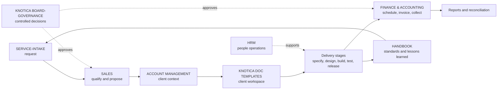

# Knotica Modules and Workflow Standard

## 1. Purpose

This document defines the operating model for the KNOTICA ERP SYSTEM. It explains what each module is for, what belongs in it, who owns it, how work moves between modules, what the setup automation creates, and which outputs are expected.

The standard has four objectives:

1. Give every business activity one clear home.
2. Keep sensitive records separated by ownership and access level.
3. Make work traceable from intake through delivery, billing, reporting, and closeout.
4. Make repository creation, permissions, labels, project links, and branch protection repeatable.

The repository contains source content for the modules. The setup scripts publish that content to GitHub repositories.

The current source layout is:

- `KNOTICA ERP SYSTEM/<module>/`: module source content, submodules, templates, registers, and ownership rules.
- `KNOTICA ERP SYSTEM/CONFIGS/agents/`: module-agent definitions and the agent registry.
- `KNOTICA ERP SYSTEM/CONFIGS/docs/`: architecture, operating, and specification documentation.
- `KNOTICA ERP SYSTEM/CONFIGS/assets/`: canonical company assets, including the letterhead image.
- `KNOTICA ERP SYSTEM/CONFIGS/setup/`: GitHub CLI setup scripts, mappings, labels, permissions, Projects, and branch protection configuration.

`CONFIGS` is an ERP configuration category, not a published business module. The setup builder uses `source-folders.txt` to map GitHub repository slugs to the display folders under `KNOTICA ERP SYSTEM`.

## 2. Naming and Connection Contract

The visible folder names are human-facing display names. GitHub API calls use URL-safe repository slugs. The two names must remain mapped as follows:

| Library folder | GitHub repository slug | Primary function |
| --- | --- | --- |
| `ACCOUNT MANAGEMENT` | `account-management` | Staff-only client account records |
| `FINANCE & ACCOUNTING` | `finance-accounting` | Invoices, payments, collections, and reconciliation |
| `HANDBOOK` | `handbook` | Policies, standards, processes, training, and templates |
| `HRM` | `hrm` | Leave, handovers, incidents, and internal communications |
| `KNOTICA BOARD-GOVERNANCE` | `board-governance` | Restricted board records and approvals |
| `KNOTICA DOC TEMPLATES` | `knotica-doc-templates` | Template source for client workspaces |
| `MARKETING` | `marketing` | Campaigns, brand, content, and analytics |
| `SALES` | `sales` | Pipeline, proposals, pricing, and commercial registers |
| `SERVICE-INTAKE` | `service-intake` | Front door for consulting requests |

Do not use a display name in a GitHub API URL, `repos.txt`, `projects.txt`, `permissions.csv`, or a `gh` command. Do not change a slug merely to change capitalization. This separation prevents folder relabeling from breaking connections, permissions, project mappings, or automation.

## 3. End-to-End Workflow

### Standard handoff

1. `SERVICE-INTAKE` records the request, requester, urgency, scope, and desired outcome.
2. `SALES` qualifies the opportunity and produces the proposal, quotation, pricing, and commercial decision.
3. `ACCOUNT MANAGEMENT` records the client context, account plan, contacts, risks, and relationship history.
4. `KNOTICA DOC TEMPLATES` provides the repeatable client workspace structure.
5. Delivery teams work through engagement, specification, design, delivery, testing, release, support, and billing sections.
6. `FINANCE & ACCOUNTING` turns the agreed billing schedule into invoices, payment records, statements, collection actions, and reconciliation.
7. `HANDBOOK` receives approved process improvements, standards, examples, and reusable templates.
8. `KNOTICA BOARD-GOVERNANCE` receives decisions requiring restricted board review.
9. `HRM` supports internal people operations and controlled handovers without becoming a client delivery repository.

Every handoff should identify an owner, a due date, the source record, the destination record, and the next status or decision.

## 4. Module Catalog

### 4.1 ACCOUNT MANAGEMENT

**Function:** Maintain staff-only client relationship and account context that should not be shared with clients.

**Objective:** Give management a reliable view of client history, contacts, account health, commitments, and risks without mixing that information into public delivery material.

**Submodules:**

- `_template/`: repeatable starting point for a new client account record.
- `_template/account-plan.md`: account objectives, relationship plan, opportunities, risks, and next actions.

**Expected outputs:** Current account plan, verified contacts, relationship notes, account risks, renewal or expansion signals, and references to approved delivery or finance records.

**Connection:** Receives qualified opportunities from `SALES`; informs client workspaces and delivery decisions; coordinates with `FINANCE & ACCOUNTING` on account status without storing accounting source records.

**Control:** Management owns all paths. Never place client credentials, payment data, or unrestricted client-facing material here.

### 4.2 FINANCE & ACCOUNTING

**Function:** Operate the invoice-to-cash process and maintain the financial evidence needed for reconciliation and reporting.

**Objective:** Make every charge, payment, credit, dispute, collection action, and balance traceable to an approved commercial source.

**Submodules:**

- `collections/`: follow-up logs, promises to pay, escalation history, and collection outcomes.
- `credit-notes/`: approved credit-note records and supporting rationale.
- `invoices/`: invoice records and issue status.
- `payments/`: payment acknowledgements and allocation evidence.
- `registers/`: control registers and reconciliation guidance.
- `reports/`: month-end ageing reports and reconciliation sign-off.
- `statements/`: statements of account issued to clients.
- `registers/Knotica_Billing_Register.xlsx`: structured billing register; protect access and retain backups.

**Expected outputs:** Approved billing schedule, issued invoice, payment allocation, statement of account, collection action, credit note, ageing report, and signed reconciliation.

**Connection:** Receives pricing and billing terms from `SALES` and client workspaces; returns payment status and account balances to `ACCOUNT MANAGEMENT`; escalates material approvals to `KNOTICA BOARD-GOVERNANCE` when required.

**Control:** Finance owns the repository. Management owns credit notes and reports. The finance-specific labels are synced by `KNOTICA ERP SYSTEM/CONFIGS/setup/04-labels.sh`.

### 4.3 HANDBOOK

**Function:** Store the controlled operating knowledge of the company.

**Objective:** Ensure recurring work is performed against an approved, discoverable standard rather than individual memory.

**Submodules:**

- `onboarding/`: new-starter and role onboarding guidance.
- `policies/`: binding rules, including `billing-policy.md`.
- `processes/`: repeatable procedures, including `billing-and-collections.md`.
- `standards/`: design and quality standards, including the organization design standard.
- `training/`: training material and capability development.
- `templates/`: reusable specifications, proposals, quotations, invoices, billing schedules, release notes, incidents, handovers, reminders, and statements.
- `templates/examples/`: worked examples such as the sample specification.

**Expected outputs:** Approved policy, standard operating procedure, reusable template, training artifact, or documented process improvement.

**Connection:** Receives lessons learned and approved changes from every module; supplies the templates and standards used by `SALES`, client workspaces, `FINANCE & ACCOUNTING`, and `HRM`.

**Control:** Management owns all paths. Changes to standards should be reviewed before becoming the default for new work.

### 4.4 HRM

**Function:** Manage internal people operations and continuity of work.

**Objective:** Keep personnel and internal operational records organized while ensuring absences, incidents, and handovers do not interrupt delivery.

**Submodules:**

- `announcements/`: approved internal announcements.
- `handover/`: role or absence handover reports, open actions, and ownership transfer.
- `incidents/`: internal incident records, response, impact, and corrective action.
- `leave/`: leave requests and coverage information.
- `meetings/`: meeting records and actions.
- `presentations/`: internal presentations and briefings.

**Expected outputs:** Leave record, coverage plan, handover report, incident report, meeting action list, announcement, or internal briefing.

**Connection:** Uses `HANDBOOK` policies and templates; hands delivery-impacting actions to the relevant operational module; escalates significant incidents to management.

**Control:** Admin-HR owns all paths. Management owns incidents. Keep sensitive personnel details restricted to the minimum necessary audience.

### 4.5 KNOTICA BOARD-GOVERNANCE

**Function:** Preserve the formal record of board-level decisions and approvals.

**Objective:** Provide an immutable, reviewable trail for decisions that affect governance, risk, finance, strategy, or delegated authority.

**Submodules:**

- `approvals/`: approval requests, evidence, decisions, and conditions.
- `decks/`: board presentation decks and supporting material.
- `financial/`: board-level financial summaries and decision support.
- `minutes/`: formal meeting minutes and action records.
- `resolutions/`: approved resolutions and their status.

**Expected outputs:** Agenda or deck, minutes, resolution, approval record, financial summary, and assigned action.

**Connection:** Receives escalations from `SALES`, `FINANCE & ACCOUNTING`, and management; sends approved decisions back to the responsible module.

**Control:** The board owns all paths. Do not use this repository for routine operational drafts.

### 4.6 KNOTICA DOC TEMPLATES

**Function:** Provide the canonical source structure for new client workspaces.

**Objective:** Make every client engagement consistent, auditable, and ready for delivery without repeatedly designing folder structures by hand.

**Submodules:**

- `00-engagement/`: client context, contacts, scope, and engagement evidence.
- `01-specs/`: requirements and specifications; includes `SPEC-TEMPLATE.md`.
- `02-design/`: solution and design records.
- `03-delivery/`: delivery plans, implementation records, and handover material.
- `04-testing/`: test plans, evidence, defects, and acceptance results.
- `05-releases/`: release records and `CHANGELOG.md`.
- `06-support/`: support requests, maintenance, and service history.
- `07-billing/`: engagement billing schedule and billing handoff.
- `assets/`: shared engagement assets.

**Expected outputs:** A new client repository with a complete working structure, populated specifications, design decisions, delivery evidence, test results, release history, support history, billing schedule, and the standard Knotica letterhead available in `assets/knotica-letterhead.png`.

**Connection:** `KNOTICA ERP SYSTEM/CONFIGS/setup/new-client.sh` uses this repository as the GitHub template, assigns teams, copies Project URLs, applies labels, and enables branch protection.

**Control:** Delivery owns the repository. Management owns engagement material. Finance owns billing material.

### 4.7 MARKETING

**Function:** Plan, create, publish, and measure company-facing marketing activity.

**Objective:** Keep campaigns and brand assets coordinated, approved, reusable, and measurable.

**Submodules:**

- `analytics/`: campaign and channel results.
- `brand/`: approved brand guidance and assets.
- `campaigns/`: campaign briefs, plans, and execution records.
- `case-studies/`: approved client stories and evidence.
- `content-calendar/`: scheduled content and owners.
- `social/`: social content and publication records.

**Expected outputs:** Campaign brief, approved content, publication schedule, case study, brand asset, and performance report.

**Connection:** Uses approved outcomes from delivery and sales only after permission and confidentiality checks. Reports performance to management and feeds successful practices into `HANDBOOK`.

**Control:** Marketing owns all paths. Client information must be approved before publication.

### 4.8 SALES

**Function:** Manage opportunity qualification and commercial progression.

**Objective:** Convert qualified demand into clear, approved, and deliverable commercial commitments.

**Submodules:**

- `pipeline/`: opportunity stage, next action, owner, value, and forecast.
- `pricing/`: approved prices, assumptions, discounts, and authority.
- `registers/`: proposal and quotation control register, including `Knotica_Document_Register.xlsx`.
- `templates/`: reusable sales document structures.
- `win-loss/`: outcome analysis and lessons learned.

**Expected outputs:** Qualified opportunity, proposal, quotation, pricing approval, commercial decision, win/loss record, and client handoff package.

**Connection:** Starts from `SERVICE-INTAKE`, consults `ACCOUNT MANAGEMENT`, uses `HANDBOOK` templates, and passes approved billing terms to `FINANCE & ACCOUNTING`.

**Control:** Sales owns all paths. Management owns pricing. Pipeline data should have a current owner and next action.

### 4.9 SERVICE-INTAKE

**Function:** Act as the controlled front door for consulting requests and service issues.

**Objective:** Prevent requests from being lost in email, chat, or personal notes and ensure every request is triaged to an accountable owner.

**Submodules:**

- The repository currently uses a single intake area with its README and CODEOWNERS. New request categories should be represented by issue forms, labels, or documented subdirectories rather than ad hoc locations.

**Expected outputs:** Intake record, triage decision, priority, assigned owner, response target, and handoff link to `SALES`, delivery, support, or `HRM` as appropriate.

**Connection:** Feeds `SALES` for commercial opportunities, delivery/support for existing clients, and the relevant incident or internal process when the request is operational.

**Control:** Management owns all paths. Intake records should contain enough context to route work but should not become the system of record for confidential finance or personnel data.

## 5. Embedded Automation and Rules

### 5.1 Setup orchestration

`KNOTICA ERP SYSTEM/CONFIGS/setup/setup.sh` runs the organization setup in this order:

1. `06-org-settings.sh`: applies organization safety settings and identifies manual 2FA work.
2. `02-create-teams.sh`: creates teams from `teams.txt`.
3. `01-create-repos.sh`: resolves each GitHub slug through `KNOTICA ERP SYSTEM/CONFIGS/setup/source-folders.txt`, copies the matching folder from `KNOTICA ERP SYSTEM`, substitutes organization placeholders, initializes Git, commits, pushes, and marks template repositories.
4. `03-permissions.sh`: applies `permissions.csv`.
5. `04-labels.sh`: synchronizes common and finance-specific labels.
6. `05-protect-main.sh`: applies pull request, approval, and CODEOWNERS branch protection.

The default is dry-run. Real changes require `DRY_RUN=false`, valid GitHub CLI authentication, and a configured author email.

### 5.2 Repository creation rule

The source directory is `KNOTICA ERP SYSTEM`. The setup data uses URL-safe slugs listed in `KNOTICA ERP SYSTEM/CONFIGS/setup/repos.txt`; `KNOTICA ERP SYSTEM/CONFIGS/setup/source-folders.txt` maps those slugs to the human-facing source folder names. A missing mapping or source folder is a release-blocking configuration error. The current checkout has no `.github` source folder, so the organization-default repository must be supplied before running repository creation for all configured repositories.

### 5.3 Access and ownership rules

- `CODEOWNERS` defines review ownership within each repository.
- `permissions.csv` defines team-to-repository baseline access.
- Organization owners are not duplicated in the permission matrix.
- Sensitive modules use restricted repositories and narrower ownership.
- A folder rename must not be implemented by changing a GitHub slug unless the remote repository and every dependent mapping are intentionally migrated together.

### 5.4 Label rules

`labels.txt` is synchronized to every repository. It includes type, status, priority, SLA, leave, and handover labels. `labels-finance-accounting.txt` adds invoice, payment, credit-note, dispute, and billing-status labels only to `finance-accounting`.

Labels provide workflow state; they are not a replacement for the source document, Project item, or approval record. A useful issue should have a type, status, owner, and priority or SLA where applicable.

### 5.5 Project rules

`projects.txt` maps repositories to organization Project numbers. `KNOTICA ERP SYSTEM/CONFIGS/setup/07-project-config.sh` and `lib.sh` generate Project URL variables for client workspaces. Project numbers are external configuration and must be checked after Projects are created or reordered.

Use Projects for cross-repository visibility and issue status. Keep detailed evidence in the owning module.

### 5.6 Branch protection rules

`protection.json` is applied to `main` by `05-protect-main.sh`. The intended controls are pull requests, at least one approval, and CODEOWNERS review. The script reports a warning when the GitHub plan or permissions do not support the rule.

### 5.7 Client onboarding automation

`KNOTICA ERP SYSTEM/CONFIGS/setup/new-client.sh`:

1. Normalizes the client code and creates `cl-<code>-<project>`.
2. Uses `knotica-doc-templates` as the template repository.
3. Grants delivery, management, and finance access where applicable.
4. Adds an optional client collaborator.
5. Copies Project URL configuration.
6. Synchronizes standard labels.
7. Adds the client label to `SALES`, `ACCOUNT MANAGEMENT`, and `FINANCE & ACCOUNTING`.
8. Applies branch protection.
9. Prints manual follow-ups for the account plan, SOW, billing schedule, document register, Project field, and first specification.

The script creates structure and connections; it does not approve commercial terms, send invoices, or replace human acceptance.

## 6. Module Agents

The module agents are defined in `KNOTICA ERP SYSTEM/CONFIGS/agents/`. There is one agent for each main module, plus a shared contract and registry. Each agent covers every submodule listed in its definition and uses the module's existing templates, labels, CODEOWNERS, and handoff rules.

Agents start in draft mode and progress through these stages:

1. Read-only search and summarization.
2. Draft generation from approved templates.
3. Issue or pull-request creation.
4. Labels, ownership, due dates, Project updates, and cross-links.
5. Human approval and controlled merge.
6. Notifications and scheduled reports.

Agents must not make autonomous financial, personnel, governance, permission, deletion, publication, or external-communication decisions. The shared contract requires source links, requester identity, generated artifacts, and approval state for every controlled action. The registry is the integration point for a future GitHub App, workflow runner, or other agent host.

### 6.1 How to use an agent

Give an agent a bounded request with five parts:

1. **Intent:** what needs to be created, reviewed, summarized, or routed.
2. **Source:** issue, record, email reference, client code, or linked evidence.
3. **Scope:** repository, submodule, reporting period, and people allowed to see the result.
4. **Expected output:** draft, issue, pull request, report, handoff, or notification draft.
5. **Approval:** named approver or the statement that the agent must request one.

Example request:

> HRM Agent: create a draft incident report from issue `#123`, use the incident template, classify impact and urgency, link related meetings, assign the HRM owner, and open a pull request. Do not notify staff until management approves it.

The agent should respond with the proposed action, source records used, files or issues changed, labels and owners applied, unresolved questions, and approval state. Ambiguous or incomplete requests should produce a clarification request, not a guessed record.

### 6.2 Agent task patterns

| Task pattern | Agent behavior | Human checkpoint |
| --- | --- | --- |
| Create a record | Select the approved template, populate fields, validate required data, and create a draft or pull request | Owner reviews content and sensitive data |
| Route a request | Classify type, priority, SLA, owner, and destination module; link the handoff | Destination owner accepts responsibility |
| Summarize work | Read authorized records, cite sources, identify decisions and overdue actions | Owner confirms accuracy before distribution |
| Generate a report | Collect records for a declared period, show exceptions and data gaps, and save a draft | Module owner approves the report |
| Update workflow state | Apply labels, assign owners, set due dates, and update Projects | Approval is required for consequential status changes |
| Send a notification | Prepare a message containing a source link and recipients | Human or approved integration sends it |

### 6.3 Module-agent examples

- **HRM:** `create_incident`, `create_meeting`, `create_handover`, `create_leave_request`, and `summarize_open_actions`.
- **Finance and Accounting:** `draft_invoice`, `record_payment`, `prepare_statement`, `prepare_collection_follow_up`, and `generate_ageing_report`.
- **Sales:** `qualify_opportunity`, `draft_proposal`, `draft_quotation`, `validate_register_id`, and `generate_pipeline_report`.
- **Service Intake:** `capture_request`, `triage_request`, `assign_sla`, `detect_duplicate`, and `route_handoff`.
- **Account Management:** `update_account_plan`, `summarize_client_risks`, and `prepare_account_review`.
- **Handbook:** `find_standard`, `draft_process_change`, `check_process_drift`, and `prepare_training_summary`.
- **Board Governance:** `assemble_approval_pack`, `draft_minutes`, `draft_resolution`, and `track_board_actions`.
- **Document Templates:** `create_client_workspace`, `validate_stage_structure`, and `generate_completeness_report`.
- **Marketing:** `draft_campaign`, `schedule_content`, `review_brand_compliance`, and `generate_campaign_report`.

These names are logical capabilities, not unrestricted shell commands. The future agent host must map them to authorized GitHub operations and enforce the registry policy.

### 6.4 Agent workflow and escalation

1. The user or an approved event invokes the module agent.
2. The agent loads only the declared module scope and shared standards.
3. The agent validates required fields, permissions, source links, and duplicate records.
4. The agent creates a draft, issue, or pull request and applies non-sensitive workflow metadata.
5. The agent requests the responsible human approval when the policy requires it.
6. A human or approved workflow merges, publishes, sends, or commits the consequential action.
7. The agent records the outcome, links the evidence, and reports failures or unresolved questions.

If a tool call fails, the agent must preserve the draft, report the exact failed step, avoid retrying destructive actions blindly, and provide a safe manual recovery path.

## 7. Reports and Records

| Reporting need | Source module | Expected report or record | Consumer |
| --- | --- | --- | --- |
| Opportunity forecast | `SALES` | Pipeline and win/loss view | Management |
| Delivery health | Client workspace | Weekly status, RAID, testing, release records | Account management and client |
| Receivables | `FINANCE & ACCOUNTING` | Ageing and collection report | Finance and management |
| Reconciliation | `FINANCE & ACCOUNTING` | Month-end register and sign-off | Finance and board when required |
| People continuity | `HRM` | Handover and incident report | Management and affected owners |
| Governance | `KNOTICA BOARD-GOVERNANCE` | Minutes, resolutions, approvals, financial summaries | Board |
| Campaign performance | `MARKETING` | Analytics and campaign report | Marketing and management |
| Process quality | `HANDBOOK` | Approved improvement, standard, or training update | All modules |

Reports should identify the reporting period, owner, source records, exceptions, decision required, and approval status. A report is not complete until its exceptions have an owner and due date.

## 8. Email and External Integration

There is currently no direct email provider integration or automated mail sender in this repository. Email references are placeholders or manual operating steps. The safe integration boundary is:

1. GitHub issue, form, or Project item is the system of record.
2. A future mail integration may notify a monitored mailbox or named recipient.
3. The notification must link back to the source issue or record.
4. Replies must be captured in GitHub or attached to the source record; email alone must not be the authoritative record.
5. Sensitive finance, personnel, credentials, and board material must not be sent through unapproved email.

Potential integrations include:

- Intake confirmation and triage notifications from `SERVICE-INTAKE`.
- Proposal or approval notifications from `SALES` and `KNOTICA BOARD-GOVERNANCE`.
- Invoice, payment, statement, and collection reminders from `FINANCE & ACCOUNTING`.
- Handover and incident alerts from `HRM`.
- Release and support notifications from client workspaces.
- Scheduled report delivery for ageing, reconciliation, campaign, and delivery health reports.

Any future integration should define authentication, sender identity, recipient rules, retry behavior, duplicate prevention, audit logging, data retention, and failure escalation before being enabled.

## 9. Operating Controls

- Use the owning module as the system of record.
- Keep the standard letterhead on all document and report templates. Use the canonical asset in `CONFIGS/assets` and synchronized module copies; branding changes must not alter fields, formulas, identifiers, approval sections, or workflow metadata.
- Link across modules instead of copying sensitive or changing data.
- Use templates for repeatable records and keep approved examples in `HANDBOOK`.
- Keep status in labels or Projects and evidence in documents.
- Require an owner and next action for open work.
- Review CODEOWNERS and permissions when responsibilities change.
- Test setup scripts in dry-run mode before applying them.
- Check Project numbers after creating or rearranging organization Projects.
- Back up and restrict the billing and document-register workbooks.
- Review the display-name-to-slug mapping after any folder rename.
- Update documentation and automation together when a module or submodule changes.

## 10. Change and Release Checklist

Before changing a module name, folder name, or workflow:

- Confirm whether the change is a display-folder rename or a GitHub repository rename.
- Preserve the GitHub-safe slug unless a remote migration is explicitly planned.
- Update `repos.txt`, `projects.txt`, `permissions.csv`, label routing, template references, and client onboarding references when the slug changes.
- Search scripts and documentation for the old path.
- Run dry-run setup validation.
- Verify source folders, CODEOWNERS, labels, permissions, Projects, and branch protection.
- Update this document and the relevant module README.
- Record the change owner, date, impact, and rollback path.

This process keeps module labels readable for people while keeping workflow connections deterministic for GitHub and future email or reporting integrations.
