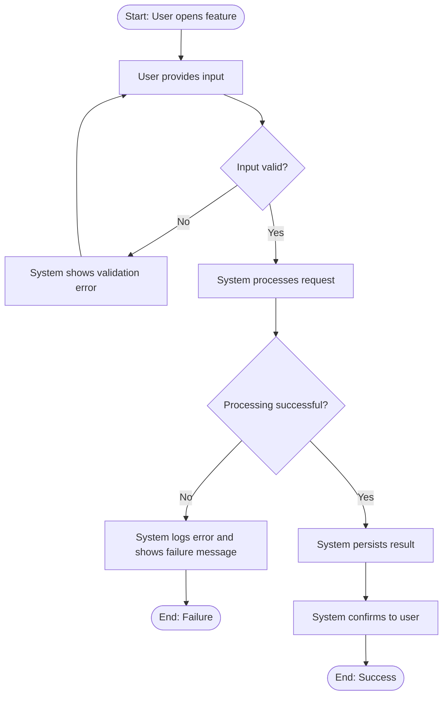
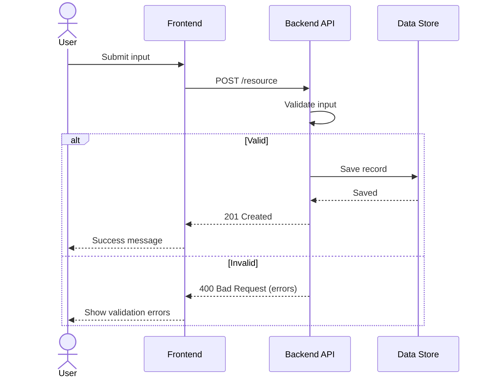

# Specification Design: `<Feature / Change Name>`
<p></p>

**Knotica Solutions Inc**

| Field | Value |
|---|---|
| **Spec ID** | SPEC-000 |
| **Status** | Draft / In Review / Approved / Implemented |
| **Author(s)** | @github-handle |
| **Reviewers** | @reviewer1, @reviewer2 |
| **Created / Updated** | YYYY-MM-DD / YYYY-MM-DD |
| **Related Issue / PR** | #000 |

> **How to use this template:** Replace every `<placeholder>`, delete guidance notes (blockquotes), and remove sections that truly don't apply (state "N/A – reason" rather than silently deleting).

---

## 1. General Requirements Statement

### 1.1 Purpose
> One or two sentences: what problem are we solving and for whom?

`<Purpose>`

### 1.2 Background / Current State (As-Is)
> Briefly describe how things work today and the pain points.

`<As-is description>`

### 1.3 Scope

| In Scope | Out of Scope |
|---|---|
| `<item>` | `<item>` |

### 1.4 Stakeholders & Actors

| Actor / Role | Description | Goal |
|---|---|---|
| `<User role>` | `<who they are>` | `<what they want>` |
| `<System / Service>` | `<internal or external system>` | `<responsibility>` |

### 1.5 Requirements

> Use unique IDs so they can be traced to scenarios, tasks, and tests. Use MoSCoW priority: **M**ust / **S**hould / **C**ould / **W**on't.

**Functional Requirements**

| ID | Requirement | Priority |
|---|---|---|
| FR-01 | The system shall `<behavior>`. | M |
| FR-02 | The system shall `<behavior>`. | S |

**Non-Functional Requirements**

| ID | Category | Requirement | Priority |
|---|---|---|---|
| NFR-01 | Performance | `<e.g., 95% of requests respond in < 500 ms>` | M |
| NFR-02 | Security | `<e.g., all inputs validated and sanitized>` | M |
| NFR-03 | Availability | `<e.g., 99.9% uptime>` | S |
| NFR-04 | Accessibility / Compliance | `<e.g., WCAG 2.2 AA>` | S |

### 1.6 Assumptions, Constraints & Dependencies

- **Assumptions:** `<...>`
- **Constraints:** `<technical, legal, budget, timeline>`
- **Dependencies:** `<teams, services, libraries, other specs>`

### 1.7 Success Criteria
> Measurable outcomes that define "done".

- [ ] `<criterion>`
- [ ] `<criterion>`

---

## 2. To-Be Process: User Workflow Diagram

> GitHub renders Mermaid natively. Show the happy path **and** key failure branches.

### 2.1 Main Workflow



### 2.2 System Interaction (Sequence)



### 2.3 Workflow Narrative

| Step | Actor | Action | Result | Req. ID |
|---|---|---|---|---|
| 1 | User | `<action>` | `<system response>` | FR-01 |
| 2 | System | `<action>` | `<outcome>` | FR-02 |

---

## 3. To-Be Process Statements (Gherkin)

> Write behavior as **Given** (precondition) / **When** (user action or event) / **Then** (system response). Use `And` / `But` to chain steps. Tag each scenario with the requirement ID and test category so they can be filtered and traced.
>
> Tip: these blocks can be copied directly into `.feature` files for Cucumber, Behave, SpecFlow, Playwright-BDD, etc.

### 3.1 Feature Definition

```gherkin
Feature: <Feature name>
  As a <role>
  I want to <capability>
  So that <business value>

  Background:
    Given the system is available
    And the user is authenticated as "<role>"
```

### 3.2 Happy Path

```gherkin
  @FR-01 @positive
  Scenario: User submits valid input
    Given the user is on the "<page / screen>"
    When the user enters "<valid value>" in the "<field>"
    And the user clicks "<Submit>"
    Then the system accepts the input
    And the system saves the record
    And the system displays "<success message>"
    And the system sends "<notification / event>" to "<target>"
```

### 3.3 Alternate Paths & Validation Rules

```gherkin
  @FR-02 @negative
  Scenario: User submits empty required field
    Given the user is on the "<page / screen>"
    When the user leaves "<field>" empty
    And the user clicks "<Submit>"
    Then the system rejects the input
    And the system displays "<field> is required"
    And no record is saved

  @FR-02 @negative
  Scenario Outline: User submits invalid values
    Given the user is on the "<page / screen>"
    When the user enters "<value>" in the "<field>"
    And the user clicks "<Submit>"
    Then the system rejects the input
    And the system displays "<error message>"

    Examples:
      | value          | error message                |
      | abc            | Must be a number             |
      | -1             | Must be greater than zero    |
      | 999999999999   | Exceeds maximum allowed      |
```

### 3.4 Error & Exception Handling

```gherkin
  @NFR-03 @negative
  Scenario: Downstream service is unavailable
    Given the user has entered valid input
    And the "<dependent service>" is unavailable
    When the user clicks "<Submit>"
    Then the system displays "<friendly error message>"
    And the system logs the error with a correlation ID
    And the system does not persist partial data
```

### 3.5 Business Rules / Decision Table

| Condition A | Condition B | Expected Outcome |
|---|---|---|
| `<value>` | `<value>` | `<result>` |
| `<value>` | `<value>` | `<result>` |

### 3.6 Requirement-to-Scenario Traceability

| Requirement ID | Gherkin Scenario(s) | Test Type(s) |
|---|---|---|
| FR-01 | User submits valid input | Positive |
| FR-02 | Empty required field; Invalid values | Negative |
| NFR-03 | Downstream service unavailable | Negative |

---

## 4. Step-by-Step Implementation

### 4.1 Technical Approach
> Summarize architecture decisions, patterns, and alternatives considered.

`<Approach>`

**Alternatives considered**

| Option | Pros | Cons | Decision |
|---|---|---|---|
| `<Option A>` | | | Chosen / Rejected |
| `<Option B>` | | | Chosen / Rejected |

### 4.2 Design Details

- **Components affected:** `<services, modules, repos>`
- **Data model changes:** `<tables, schemas, migrations>`
- **API / Interface changes:** `<endpoints, contracts, events>`
- **Configuration / Feature flags:** `<flags, env vars>`
- **Security & privacy considerations:** `<authN/authZ, PII, secrets>`
- **Observability:** `<logs, metrics, alerts, dashboards>`

### 4.3 Implementation Plan

> Each step should be small, independently reviewable, and traceable to a requirement.

| # | Step | Description | Req. ID | Owner | Est. | Status |
|---|---|---|---|---|---|---|
| 1 | Setup | `<branch, scaffolding, flags>` | – | @dev | `<0.5d>` | ☐ |
| 2 | Data layer | `<migrations, models>` | FR-01 | @dev | `<1d>` | ☐ |
| 3 | Business logic | `<services, validation>` | FR-01, FR-02 | @dev | `<2d>` | ☐ |
| 4 | API / UI | `<endpoints, screens>` | FR-01 | @dev | `<2d>` | ☐ |
| 5 | Error handling | `<failure paths, logging>` | NFR-03 | @dev | `<1d>` | ☐ |
| 6 | Automated tests | `<implement feature files + unit tests>` | All | @qa | `<2d>` | ☐ |
| 7 | Documentation | `<README, API docs, runbook>` | – | @dev | `<0.5d>` | ☐ |

### 4.4 Rollout & Rollback

- **Rollout strategy:** `<big bang / phased / feature flag / canary>`
- **Rollback plan:** `<how to revert safely, incl. data>`
- **Migration / backfill:** `<if applicable>`

### 4.5 Definition of Done

- [ ] All **Must** requirements implemented
- [ ] All Gherkin scenarios automated and passing
- [ ] Code reviewed and merged
- [ ] Documentation updated
- [ ] Monitoring/alerts in place
- [ ] Stakeholder sign-off received

---

## 5. Test Scoping

> Determine **what** needs testing in each category. List test targets here; the Gherkin in Section 3 provides the detailed scenarios. Mark non-applicable categories as "N/A – reason".

### 5.1 Test Strategy Overview

| Test Level | In Scope? | Tooling | Notes |
|---|---|---|---|
| Unit | Yes / No | `<e.g., Jest, pytest, JUnit>` | |
| Integration | Yes / No | `<tool>` | |
| End-to-End / UI | Yes / No | `<e.g., Playwright, Cypress>` | |
| Performance / Load | Yes / No | `<e.g., k6, JMeter, Locust>` | |
| Security | Yes / No | `<e.g., OWASP ZAP, SAST/DAST>` | |

**Test environments & data:** `<environments, seed data, masking rules, test accounts>`

### 5.2 Positive Testing (Valid Behavior)
> Confirm the system does what it should with valid input and expected conditions.

| ID | What to Test | Linked Req. | Priority |
|---|---|---|---|
| P-01 | Valid input accepted and saved | FR-01 | High |
| P-02 | `<role-based access works for each role>` | FR-02 | High |
| P-03 | `<expected notifications / side effects fire>` | FR-01 | Medium |

### 5.3 Negative Testing (Invalid Behavior)
> Confirm the system safely rejects bad input, unauthorized access, and failures.

| ID | What to Test | Linked Req. | Priority |
|---|---|---|---|
| N-01 | Required fields missing | FR-02 | High |
| N-02 | Wrong data type / format / length | FR-02 | High |
| N-03 | Unauthorized or unauthenticated access | NFR-02 | High |
| N-04 | Injection / malicious payloads (SQLi, XSS) | NFR-02 | High |
| N-05 | Dependency down / timeout / bad response | NFR-03 | Medium |
| N-06 | Duplicate submission / replay | FR-01 | Medium |

### 5.4 Performance Testing
> Define measurable targets taken from the non-functional requirements.

| ID | Test Type | Target / Threshold | Load Profile | Linked Req. |
|---|---|---|---|---|
| PF-01 | Response time | p95 < `<500 ms>` | `<100 concurrent users>` | NFR-01 |
| PF-02 | Load | `<X req/s>` sustained for `<30 min>` | `<expected peak>` | NFR-01 |
| PF-03 | Stress | Identify breaking point; graceful degradation | `<2–3× peak>` | NFR-03 |
| PF-04 | Soak / Endurance | No memory leaks over `<8 h>` | `<average load>` | NFR-03 |
| PF-05 | Spike | Recovers within `<N min>` after burst | `<sudden 5× load>` | NFR-03 |

### 5.5 Edge Case Testing
> Boundaries, unusual states, and rare-but-possible situations.

| ID | What to Test | Example | Linked Req. |
|---|---|---|---|
| E-01 | Boundary values | Min, max, min−1, max+1 | FR-02 |
| E-02 | Empty / null / whitespace-only | `""`, `null`, `"   "` | FR-02 |
| E-03 | Special characters & Unicode | Emoji, RTL text, quotes, very long strings | FR-02 |
| E-04 | Concurrency | Two users editing the same record | FR-01 |
| E-05 | Time-related | Time zones, DST, leap day, month-end | `<ID>` |
| E-06 | Large data volume | Max records / file size / pagination limits | NFR-01 |
| E-07 | Interrupted flow | Network drop, browser refresh, session expiry mid-process | FR-01 |
| E-08 | Data state | Empty database, legacy/migrated data | `<ID>` |

### 5.6 Out of Test Scope
> Explicitly list what will **not** be tested and why (risk accepted by whom).

- `<item>` — `<reason / accepted by>`

### 5.7 Entry & Exit Criteria

| Entry Criteria | Exit Criteria |
|---|---|
| Spec approved | 100% of High-priority tests pass |
| Test environment and data ready | No open Critical/High defects |
| Build deployed and smoke test passed | Performance targets met |
| | Traceability matrix complete |

### 5.8 Risks & Mitigations

| Risk | Likelihood | Impact | Mitigation |
|---|---|---|---|
| `<risk>` | L / M / H | L / M / H | `<action>` |

---

## 6. Open Questions & Decisions Log

| # | Question / Decision | Owner | Status | Resolution |
|---|---|---|---|---|
| 1 | `<question>` | @owner | Open / Closed | `<answer>` |

## 7. Approvals

| Name | Role | Date | Decision |
|---|---|---|---|
| | Product Owner | | ☐ Approved |
| | Tech Lead | | ☐ Approved |
| | QA Lead | | ☐ Approved |

## 8. Revision History

| Version | Date | Author | Changes |
|---|---|---|---|
| 0.1 | YYYY-MM-DD | @author | Initial draft |
