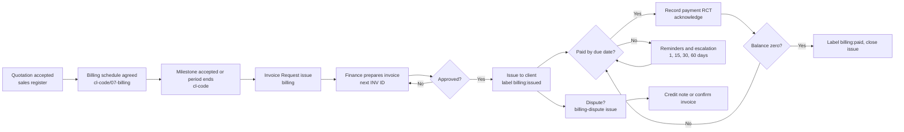

# Process: Billing and Collections

| Field | Value |
|---|---|
| Owner | Finance lead (`<name>`) |
| Applies to | Every invoice, payment, credit note and statement |
| Policy | `handbook/policies/billing-policy.md` |
| Workspace | `billing` repo and `registers/Knotica_Billing_Register.xlsx` |

## Flow

## Steps, owners and target times

Target times are defaults. Management can change them in this document.

| # | Step | Owner | Target |
|---|---|---|---|
| 1 | Agree the billing schedule with the client at quotation or SOW stage | Sales / delivery lead | Before kickoff |
| 2 | Open an **Invoice Request** with evidence (sign-off, timesheets, receipts) | Delivery lead | Within 2 business days of milestone acceptance or period end |
| 3 | Check the request against the quotation, billing schedule and PO. Take the next ID from the register | Finance | 1 business day |
| 4 | Prepare the invoice from `templates/invoice.md` | Finance | 1 business day |
| 5 | Approve (rules in the billing policy) | Approver | 1 business day |
| 6 | Issue the PDF, add the label `billing:issued`, copy to the client's `07-billing/` folder, log it in the register | Finance | Same day |
| 7 | Record each payment (**Payment Received** issue, register row, acknowledgement) | Finance | 1 business day after funds arrive |
| 8 | Follow up overdue invoices with the reminder levels | Finance, then management | At 1, 15, 30, 60 days past due |
| 9 | Handle disputes and credit notes | Finance, management approves | Acknowledge a dispute within 2 business days |
| 10 | Month-end: send statements, produce the ageing report, reconcile to the accounting system and bank | Finance, management reviews | By business day 5 |

## Roles

| Role | Can do | Cannot do |
|---|---|---|
| Delivery lead | Request invoices, supply evidence, help resolve disputes | Issue invoices, record payments |
| Finance | Prepare and issue invoices, record payments, send reminders and statements | Approve own credit notes or write-offs |
| Management | Approve invoices above the threshold, credit notes, final notices, write-offs within limit | |
| Board | Approve write-offs above the limit (`board-governance` approval request) | |

Where the team is small, one person may hold two roles, but the person who prepares an invoice should not also approve it, and the person who records payments should not be the only one who can issue invoices. Note any exception in the month-end sign-off.

## Month-end checklist

- [ ] Every invoice issued this month is in the register, with its PDF in `invoices/` and the client's `07-billing/` folder
- [ ] Every payment received is recorded and matched to an invoice
- [ ] Register Dashboard integrity checks all show OK
- [ ] Statements sent to clients with open balances
- [ ] Ageing report saved in `reports/`
- [ ] Register totals reconciled to the accounting system and bank; differences explained
- [ ] Overdue items over 30 days reviewed by management
