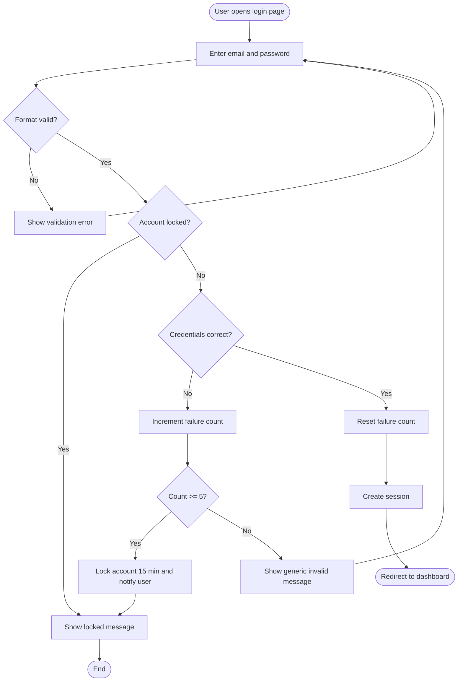
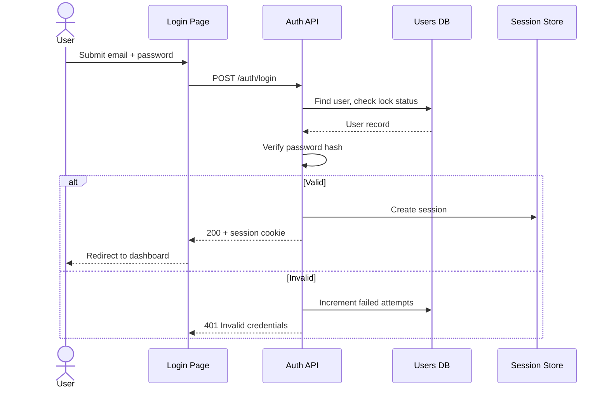

# Specification Design: User Login with Email & Password
<p></p>

**Knotica Solutions Inc**

| Field | Value |
|---|---|
| **Spec ID** | SPEC-001 |
| **Status** | Draft |
| **Author(s)** | @jane-dev |
| **Reviewers** | @tech-lead, @qa-lead |
| **Created / Updated** | 2026-10-01 / 2026-10-01 |
| **Related Issue / PR** | #42 |

---

## 1. General Requirements Statement

### 1.1 Purpose
Allow registered users to securely sign in with email and password so they can access their account.

### 1.2 Background / Current State (As-Is)
There is no authentication. All pages are public, and user data cannot be personalised or protected.

### 1.3 Scope

| In Scope | Out of Scope |
|---|---|
| Email/password login | Social login (Google, GitHub) |
| Account lockout after failed attempts | Multi-factor authentication |
| Session creation and logout | Self-service registration |

### 1.4 Stakeholders & Actors

| Actor / Role | Description | Goal |
|---|---|---|
| Registered User | Person with an existing account | Sign in quickly and securely |
| Auth Service | Backend authentication API | Verify credentials, issue sessions |
| Security Team | Reviews compliance | Ensure brute-force protection |

### 1.5 Requirements

**Functional Requirements**

| ID | Requirement | Priority |
|---|---|---|
| FR-01 | The system shall authenticate a user with a valid email and password and create a session. | M |
| FR-02 | The system shall reject invalid credentials with a generic error message. | M |
| FR-03 | The system shall lock an account for 15 minutes after 5 consecutive failed attempts. | M |
| FR-04 | The system shall validate the email format and require a non-empty password before submission. | S |
| FR-05 | The system shall allow a signed-in user to log out and end the session. | S |

**Non-Functional Requirements**

| ID | Category | Requirement | Priority |
|---|---|---|---|
| NFR-01 | Performance | 95% of login requests complete in under 500 ms at 100 concurrent users. | M |
| NFR-02 | Security | Passwords are hashed (bcrypt/argon2); credentials never logged; HTTPS only. | M |
| NFR-03 | Availability | Login service available 99.9% monthly. | S |

### 1.6 Assumptions, Constraints & Dependencies
- **Assumptions:** User accounts already exist in the `users` table.
- **Constraints:** Must use the existing PostgreSQL database.
- **Dependencies:** Session store (Redis), email service for lockout notification.

### 1.7 Success Criteria
- [ ] Valid users can sign in and reach the dashboard
- [ ] Brute-force attempts are blocked after 5 failures
- [ ] p95 login latency under 500 ms

---

## 2. To-Be Process: User Workflow Diagram





| Step | Actor | Action | Result | Req. ID |
|---|---|---|---|---|
| 1 | User | Enters email and password, clicks Sign in | Form submitted | FR-04 |
| 2 | System | Checks lock status and verifies credentials | Pass or fail | FR-01, FR-03 |
| 3 | System | Creates session on success | User lands on dashboard | FR-01 |
| 4 | System | Counts failure on error | Lock at 5 failures | FR-02, FR-03 |

---

## 3. To-Be Process Statements (Gherkin)

```gherkin
Feature: User login
  As a registered user
  I want to sign in with my email and password
  So that I can access my account securely

  Background:
    Given a registered user exists with email "jane@example.com" and password "Correct#Pass1"
    And the user is on the login page

  @FR-01 @positive
  Scenario: Successful login
    When the user enters "jane@example.com" and "Correct#Pass1"
    And the user clicks "Sign in"
    Then the system accepts the credentials
    And the system creates a session
    And the user is redirected to the dashboard
    And the failed attempt counter is reset to 0

  @FR-02 @negative
  Scenario: Wrong password
    When the user enters "jane@example.com" and "WrongPass"
    And the user clicks "Sign in"
    Then the system rejects the login
    And the system displays "Invalid email or password"
    And the failed attempt counter increases by 1

  @FR-02 @negative
  Scenario: Unknown email returns the same generic message
    When the user enters "nobody@example.com" and "AnyPass1"
    And the user clicks "Sign in"
    Then the system displays "Invalid email or password"

  @FR-03 @negative
  Scenario: Account locks after 5 failed attempts
    Given the user has failed to log in 4 times
    When the user enters "jane@example.com" and "WrongPass"
    And the user clicks "Sign in"
    Then the system locks the account for 15 minutes
    And the system displays "Account locked. Try again in 15 minutes"
    And the system sends a lockout notification email

  @FR-03 @edge
  Scenario: Correct password is rejected while account is locked
    Given the account is locked
    When the user enters "jane@example.com" and "Correct#Pass1"
    And the user clicks "Sign in"
    Then the system rejects the login
    And the system displays "Account locked. Try again in 15 minutes"

  @FR-04 @negative
  Scenario Outline: Client-side validation
    When the user enters "<email>" and "<password>"
    And the user clicks "Sign in"
    Then the system does not submit the request
    And the system displays "<message>"

    Examples:
      | email         | password | message                    |
      |               | Pass1    | Email is required          |
      | jane@         | Pass1    | Enter a valid email        |
      | jane@test.com |          | Password is required       |

  @FR-05 @positive
  Scenario: User logs out
    Given the user is signed in
    When the user clicks "Log out"
    Then the system ends the session
    And the user is redirected to the login page
```

| Requirement ID | Gherkin Scenario(s) | Test Type(s) |
|---|---|---|
| FR-01 | Successful login | Positive |
| FR-02 | Wrong password; Unknown email | Negative |
| FR-03 | Lock after 5 failures; Correct password while locked | Negative, Edge |
| FR-04 | Client-side validation | Negative |
| FR-05 | User logs out | Positive |

---

## 4. Step-by-Step Implementation

### 4.1 Technical Approach
Add a `POST /auth/login` endpoint to the existing API. Passwords are verified with argon2, and sessions are stored in Redis with an HTTP-only secure cookie.

| Option | Pros | Cons | Decision |
|---|---|---|---|
| Server-side sessions (Redis) | Easy revocation | Needs session store | Chosen |
| Stateless JWT | No store needed | Harder to revoke | Rejected |

### 4.2 Design Details
- **Data model changes:** add `failed_attempts INT`, `locked_until TIMESTAMP` to `users`
- **API changes:** `POST /auth/login`, `POST /auth/logout`
- **Feature flag:** `auth_login_enabled`
- **Security:** rate limit by IP; generic error messages; no credentials in logs
- **Observability:** log login success/failure counts; alert on spike in failures

### 4.3 Implementation Plan

| # | Step | Description | Req. ID | Owner | Est. | Status |
|---|---|---|---|---|---|---|
| 1 | Setup | Branch, feature flag, Redis config | – | @jane-dev | 0.5d | ☐ |
| 2 | Data layer | Migration for lockout columns | FR-03 | @jane-dev | 0.5d | ☐ |
| 3 | Business logic | Credential check, lockout rules | FR-01–03 | @jane-dev | 2d | ☐ |
| 4 | API | `/auth/login`, `/auth/logout` | FR-01, FR-05 | @jane-dev | 1d | ☐ |
| 5 | UI | Login form with validation | FR-04 | @ui-dev | 1.5d | ☐ |
| 6 | Notifications | Lockout email | FR-03 | @jane-dev | 0.5d | ☐ |
| 7 | Tests | Automate feature file + unit tests | All | @qa-lead | 2d | ☐ |
| 8 | Docs | API docs and runbook | – | @jane-dev | 0.5d | ☐ |

### 4.4 Rollout & Rollback
- **Rollout:** enable `auth_login_enabled` for internal users, then 10%, then 100%
- **Rollback:** disable the flag; the migration is additive so no data revert is needed

### 4.5 Definition of Done
- [ ] All Must requirements implemented
- [ ] All Gherkin scenarios automated and passing
- [ ] Code reviewed and merged
- [ ] Docs and alerts in place

---

## 5. Test Scoping

### 5.1 Test Strategy Overview

| Test Level | In Scope? | Tooling | Notes |
|---|---|---|---|
| Unit | Yes | pytest | Hashing, lockout logic |
| Integration | Yes | pytest + test DB | API + DB + Redis |
| End-to-End / UI | Yes | Playwright | Feature file scenarios |
| Performance | Yes | k6 | Login endpoint |
| Security | Yes | OWASP ZAP | Injection, brute force |

### 5.2 Positive Testing

| ID | What to Test | Linked Req. | Priority |
|---|---|---|---|
| P-01 | Valid credentials create a session | FR-01 | High |
| P-02 | Failure counter resets after success | FR-01 | Medium |
| P-03 | Logout ends the session | FR-05 | Medium |

### 5.3 Negative Testing

| ID | What to Test | Linked Req. | Priority |
|---|---|---|---|
| N-01 | Wrong password and unknown email give identical messages | FR-02 | High |
| N-02 | Lockout after 5 failures | FR-03 | High |
| N-03 | SQL injection / XSS in email field | NFR-02 | High |
| N-04 | Empty or malformed fields | FR-04 | Medium |
| N-05 | Redis or DB unavailable | NFR-03 | Medium |

### 5.4 Performance Testing

| ID | Test Type | Target / Threshold | Load Profile | Linked Req. |
|---|---|---|---|---|
| PF-01 | Response time | p95 < 500 ms | 100 concurrent users | NFR-01 |
| PF-02 | Load | 50 logins/s for 30 min | Expected peak | NFR-01 |
| PF-03 | Spike | Recovers within 2 min | 5× burst (e.g. Monday 9am) | NFR-03 |

### 5.5 Edge Case Testing

| ID | What to Test | Example | Linked Req. |
|---|---|---|---|
| E-01 | Lockout boundaries | Attempt 4 vs 5 vs 6 | FR-03 |
| E-02 | Lock expiry | Login at 14:59 vs 15:01 after lock | FR-03 |
| E-03 | Unicode / very long input | Emoji in password, 10,000-char email | FR-04 |
| E-04 | Concurrent logins | Same account from two devices at once | FR-01 |
| E-05 | Session expiry mid-action | Cookie expires during form submit | FR-01 |
| E-06 | Case sensitivity | `Jane@Example.com` vs `jane@example.com` | FR-01 |

### 5.6 Out of Test Scope
- MFA and social login (separate specs)

### 5.7 Entry & Exit Criteria

| Entry Criteria | Exit Criteria |
|---|---|
| Spec approved | 100% High-priority tests pass |
| Test environment ready | No open Critical/High defects |
| Build deployed, smoke test passed | p95 under 500 ms confirmed |

### 5.8 Risks & Mitigations

| Risk | Likelihood | Impact | Mitigation |
|---|---|---|---|
| Lockout used to deny service to real users | M | H | IP rate limiting; email unlock option |

---

## 6. Open Questions & Decisions Log

| # | Question / Decision | Owner | Status | Resolution |
|---|---|---|---|---|
| 1 | Should lockout duration be configurable? | @tech-lead | Open | |

## 7. Approvals

| Name | Role | Date | Decision |
|---|---|---|---|
| | Product Owner | | ☐ Approved |
| | Tech Lead | | ☐ Approved |
| | QA Lead | | ☐ Approved |

## 8. Revision History

| Version | Date | Author | Changes |
|---|---|---|---|
| 0.1 | 2026-10-01 | @jane-dev | Initial draft |
